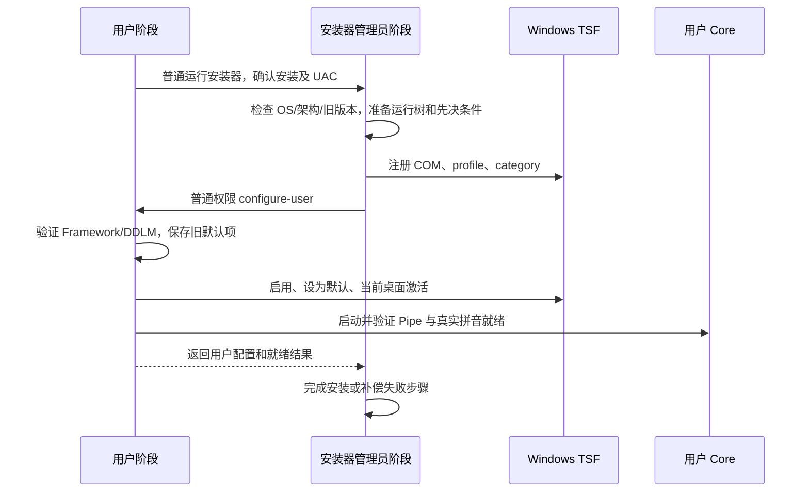

# Windows 安装包设计

日期：2026-10-10。状态：第一阶段实现已接入，真实系统安装仍需在 CI/干净虚拟机验证。以下代码现状来自本次仓库检查；API 行为依据文末及各节链接的官方资料。

## 推荐决策

第一阶段使用 **Inno Setup 7 的 x64 安装器，同时输出含运行库的离线 EXE 和不含外部运行库的 EXE**，安装范围为 Windows 11 x64。将完整运行树安装到 Program Files，自动注册 TSF、启用安装发起用户的输入法、设置默认输入法并尝试当前桌面激活，后台启动 Core。含运行库版本的用户只需运行安装器、确认安装及 UAC；不需要运行 PowerShell、打开 Windows 输入设置或手动启动服务。不含运行库版本要求预先安装所需依赖。

安装包选用 EXE 已满足“exe/msi”的交付目标。暂不同时维护两种安装引擎。如果明确需要 MSI 的企业分发、修复或组策略能力，改用 WiX + Burn：MSI 管理文件和机器注册，Burn EXE 管理先决条件与用户阶段，两者复用下文的原生辅助工具。不能把 EXE 更改扩展名当成 MSI，也不能将 MSI 的 SYSTEM 执行环境当成用户桌面。

| 方案 | 优点 | 本项目的主要代价 | 结论 |
| --- | --- | --- | --- |
| Inno Setup EXE | 单文件、中文向导、卸载、签名、静默安装、占用文件重启删除；易接入 PowerShell CI | TSF 用户初始化和失败补偿需要自己实现 | 第一阶段推荐 |
| WiX MSI + Burn EXE | MSI 文件管理、修复与事务能力；Burn 可串联运行时 | 用户身份分离、TSF custom action、回滚和 bootstrapper 仍需开发 | 有 MSI 硬性要求时采用 |
| NSIS EXE | 灵活，能满足同类需求 | 安装状态、失败处理及维护逻辑同样需要自行编写 | 没有优于 Inno 的现有项目基础 |
| MSIX | 包管理和自动更新便利 | 当前是 unpackaged WinUI + 加载到其他应用的 TSF COM DLL，不能直接套用应用打包模板 | 本阶段不选；不据此断言任何 TSF 永远无法使用 MSIX |

[Inno 官方功能列表](https://jrsoftware.org/isinfo.php)支持单 EXE、卸载及数字签名。[下载页](https://jrsoftware.org/isdl.php)本次列出 `7.1.0-x64`；实施时固定经过验证的版本、下载地址和 SHA256，不依赖 runner 的预装版本或 latest。Inno 与现代 WiX 都应按实际使用场景核对许可，不能假定“开源”意味着所有商业构建都无条件免费；参见 [WiX 版本与许可说明](https://docs.firegiant.com/wix/whatsnew/)。

## 现有代码与缺口

| 位置 | 已有能力 | 安装包需要补齐 |
| --- | --- | --- |
| `scripts/build-and-deploy.ps1` | Release 构建 Core/TSF/Settings、默认 CTest，输出 `bin/lib/share/tsf/settings` | 将经过验证的运行树交给独立打包脚本；保留开发部署行为 |
| `win32/dll/register.cpp`、`main.cpp` | COM 注册、简体中文 profile、category、注册失败时尝试清理 | 可诊断且幂等的注册/注销、用户启用与激活、升级注册归属检查 |
| `win32/tsf/servicecontrol.cpp` | 从 DLL 的上级安装树定位 `bin/Fcitx5.exe`，自动后台启动 | 安装/卸载维护状态，首次安装就绪检查 |
| `win32/ipc/service.h` | SID/session/logon 级服务控制、正常停止、手动关闭状态 | 跨安装生命周期的维护阻止状态；当前登录身份以外不能直接套用现有控制对象 |
| `win32/settings/Fcitx5Settings.vcxproj`、`main.cpp` | 框架依赖 WinUI，显式 bootstrap | 自动安装符合最低版本的 Framework/DDLM 和 VC++ 运行时 |
| `.github/workflows/ci.yml` | Core 双架构、TSF、拼音 probes、独立 Settings 构建 | 一次构建的完整 Release 安装包、安装/卸载验收及 artifact |

`RegisterProfiles()` 已使用 `bEnabledByDefault=TRUE`，但仍需查询实际用户状态并显式启用，不能由此推断输入列表、默认输入法与当前桌面都已完成切换。现有 `install.ps1` 的完成提示仍要求重新打开应用、用 Win+Space 选择。

正式安装前需要完善注册错误处理：`RegisterServer()` 当前使用 `MAX_PATH`、混合聚合注册表错误，失败后仍可能继续使用无效句柄，DLL 路径 REG_SZ 长度未包含终止符；`DllUnregisterServer()` 则不检查清理结果而直接返回 `S_OK`。现有 mock 测试不是这些真实系统失败路径的完整验证。

## 支持范围必须明确

第一阶段只能承诺通过实际验收的 Windows 11 x64 桌面应用。当前 x64 DLL 不能加载到 x86 应用；ARM64 Core 能编译也不代表 ARM64 TSF 能使用。

若发布目标是“x64 Windows 上常见的 32/64 位应用均可输入”，**x86 TSF 的构建、注册和应用测试必须作为发布前置工作**。两种 DLL 使用相同 CLSID/profile，在相应 COM 注册视图分别注册，共用 x64 Core 和现有 IPC，不需要将解码库编进 x86 DLL。[Microsoft 的 TSF 架构说明](https://learn.microsoft.com/en-gb/windows/win32/tsf/64-bit-platform-considerations)明确 DLL 位数必须匹配宿主，并说明并存注册与 Program Files 路径要求。

仅有 x64 产物时设置 `ArchitecturesAllowed=x64os`，而不是接受 ARM64 仿真的 `x64compatible`；安装器能在仿真下运行不等于原生应用能加载 TIP。详见 [Inno 架构标识](https://jrsoftware.org/ishelp/topic_archidentifiers.htm)。当前 Settings 最低 OS build 为 `22000`，安装包不擅自宣称 Windows 10 支持。

机器范围文件安装与当前用户启用分开：第一版自动配置发起安装的用户，其他账户的输入偏好保持其自身状态。若要所有账户也自动启用，需要另行增加每用户登录初始化，不能用一次管理员注册来宣称已配置所有账户。

## 安装树和依赖

保持当前路径约定，使用安装器提供的 Program Files known directory，不硬编码 `C:`：

```text
<ProgramFiles>/Fcitx5/
  bin/Fcitx5.exe + Core/MSYS2 运行 DLL
  lib/fcitx5/ + lib/libime/zh_CN.lm
  share/fcitx5/ + share/libime/sc.dict + 配置及其他资源
  tsf/fcitx5-x86_64.dll
  settings/Fcitx5Settings.exe + DLL/PRI/WinMD
  setup/Fcitx5SetupHelper.exe
  licenses/ + 安装文件清单
  unins*.exe + 卸载记录
```

TSF DLL 继续位于 `tsf`，Core 继续位于 `bin`，Settings 继续位于 `settings`，三套工具链及 IPC 边界保持现有设计。安装不覆盖 `%APPDATA%/Fcitx5` 用户配置、词典和学习历史。机器状态与清理辅助文件放在管理员可写、普通用户只读的 ProgramData 子目录；用户初始化日志及先前默认输入项放在该用户 LocalAppData。

打包输入是完整构建暂存树，输出前生成显式文件清单，保留全部运行资源和递归 DLL 依赖；只排除有依据的 SDK 头文件、import libraries、测试程序和调试文件。现有部署脚本不是最小运行文件清单，不能只拿三个 exe/dll 来打包。

发行附件同时提供与二进制对应的源码定位/归档：主仓库 commit、固定子模块、Windows 补丁和构建脚本，并整理实际捆绑依赖的许可证及所需源码交付方式。仅附主仓库 LICENSE 不能代替全部依赖的发行要求。

保留目前用户选择的 **framework-dependent Settings**：离线包附带 Microsoft 官方 x64 VC++ Redistributable 和匹配构建最低版本的 Windows App Runtime 安装程序。版本、架构、SHA256 和上游签名进入依赖锁定文件。分别识别返回码，已装更新兼容运行时时跳过或验证满足要求，不降级，不强制关闭其他 WinUI 应用。

`build-installer.ps1 -SkipRuntimes` 生成 `Fcitx5-<version>-x64-no-runtime-setup.exe`，不要求运行库安装程序存在，也不嵌入或执行它们。此版本保留完整 Core/TSF/Settings 运行树及其应用 DLL；使用者须预先安装 x64 VC++ Runtime 和当前用户的 Windows App SDK 1.8 Framework/DDLM >= `8000.994.2142.0`。用户阶段仍执行 Settings 的 `--runtime-check`，缺少依赖时安装不能成功完成用户初始化。默认不带该参数的包名及运行库安装行为保持现有约定。

VC++ 依赖由管理员阶段安装；Windows App Runtime 必须验证安装发起用户实际具备所需 Framework/DDLM，必要时在该用户阶段运行官方安装程序的 `--quiet`。管理员代输凭据时，给管理员账户注册 runtime 不能替代原用户注册。用户阶段以 bootstrap 实际成功为验收，不仅检查机器文件存在。官方部署指南允许安装器串联运行时：[framework-dependent 部署](https://learn.microsoft.com/en-us/windows/apps/windows-app-sdk/deploy-unpackaged-apps)。共享运行时在卸载 Fcitx5 时保留。

Settings self-contained 可作为后续简化方向：[官方方案](https://learn.microsoft.com/en-us/windows/apps/package-and-deploy/self-contained-deploy/deploy-self-contained-apps)。它需要调整当前显式 bootstrap、自动初始化和输出复制规则；不是给现有目录多复制一个 DLL 即可，也不在本方案中默认更改既有部署选择。

## 原生辅助工具与权限

新增独立 Windows SDK/ATL 目标 `Fcitx5SetupHelper.exe`，采用与 TSF 相同的工具环境，避免要求用户安装 PowerShell 7、MSYS2 或 .NET。它复用注册与服务控制实现，不复用调用 shell 的开发脚本。单个工具划分明确子命令：

| 子命令（设计名称） | 执行身份 | 职责 |
| --- | --- | --- |
| `register-machine` / `unregister-machine` | 管理员 | COM、profile、category，检查真实结果与安装归属 |
| `configure-user` | 安装发起用户，普通权限 | 保存旧默认项、部署/验证用户 runtime、启用/默认/激活、Core 就绪验证 |
| `prepare-uninstall-user` | 对应登录用户，普通权限 | 必要时切换到其他输入法、移除用户启用、正常停止自己的 Core/Settings |
| `set-maintenance` / `clear-maintenance` | 管理员 | 管理安装生命周期状态，阻止服务拉起 |
| `inspect-locks` / `cleanup-pending` | 按操作需要 | 查询占用、精确文件清理和重启需求 |

命令等待完成，输出稳定退出码与日志；自定义退出码要与 Inno 返回码分开记录。所有系统变更命令支持无副作用预览。提升阶段仅接受固定操作和经核验的安装根，不接受用户可写文件中的任意命令、DLL 路径或删除路径。

安装时使用 `ExecAsOriginalUser(..., ewWaitUntilTerminated, ...)` 完成用户阶段，记录并核对 SID、session 和令牌完整性级别；不在高权限阶段直接启动常驻 Core/Settings。[Inno 文档](https://jrsoftware.org/ishelp/topic_isxfunc_execasoriginaluser.htm)说明该方法只能用于安装，**不能用于卸载**。

卸载入口需要普通权限的原生 launcher/user agent：开始菜单及应用卸载项先启动它，保留原用户会话，再提升运行真正的卸载器，通过限定命令的握手协调用户阶段。用户部分只操作自己的偏好和服务，机器部分只操作本产品注册及文件。用户代理通信使用随机会话标识、SID ACL 与对端身份核验，不允许普通用户借它执行任意管理员操作。

直接从已提升终端启动、右键“以管理员身份运行”、SYSTEM 静默安装等环境可能没有原始普通用户令牌。[Inno 的 runasoriginaluser 限制](https://jrsoftware.org/ishelp/topic_runsection.htm)明确不能自动恢复不存在的原始身份。该分支必须识别：可以提供经验证的交互用户代理或登录初始化；没有可用用户会话时仅执行机器阶段，返回“待用户初始化”，不能显示“当前用户立即可用”。普通双击 + UAC（包括其他管理员代输凭据）是第一版的主要验收路径。

## 安装流程



1. 检查系统版本和 PE 架构、磁盘、依赖锁、安装状态、待清理状态，取得安装互斥。发现旧的开发版注册路径时识别冲突，不静默删除另一路径的注册；受管理旧版本才进入升级。
2. 保存已有机器注册与用户偏好的必要快照，准备同版本完整运行树。安装包附带正式授权的运行时和许可证，不在用户机器编译、下载拼音数据或寻找开发依赖。
3. 安装 VC++ 依赖及程序文件，核验资源；从最终安装路径注册 DLL。注册失败视为安装失败，保存具体 HRESULT/Win32 错误并执行补偿。
4. 普通用户阶段验证 Windows App Runtime，启用输入法并完成默认/激活。默认目标为“立即可用”，首次安装自动选择 Fcitx5；升级不反复覆盖用户后来修改的默认偏好。安装向导清楚说明会将其设为当前用户默认输入法，可提供保留现有默认的可选项。
5. 清除本次安装应解除的旧手动关闭状态，后台启动 Core，等待用户级 Named Pipe 协议与引擎资源就绪。新增健康检查应无修改用户词典/设置的副作用；真实中文提交由安装验收程序验证。
6. 用户配置或就绪失败时停止本次启动的服务、还原本次改变的偏好与注册，保留可重试诊断。Inno 的外部执行步骤不能被当成 MSI 事务；辅助工具记录已完成步骤并显式补偿，崩溃后保留恢复记录。只有就绪检查通过才显示“可使用”。

Inno 脚本的关键配置为 `SetupArchitecture=x64`、`ArchitecturesAllowed=x64os`、64 位安装模式、`MinVersion=10.0.22000`、`PrivilegesRequired=admin` 和固定 AppId。显式设置 `CloseApplications=no`、`RestartApplications=no`，避免安装引擎默认自动关闭应用；不设置强制重启。DLL 的 `uninsrestartdelete` 与原生注销流程配合，避免同时由 `regserver` 和 helper 重复管理注册。

用户启用调用 `InstallLayoutOrTip`，使用本项目的 profile 描述串：

```text
0x0804:{FC3869BA-51E3-4078-8EE2-5FE49493A1F4}{9A92B895-29B9-4F19-9627-9F626C9490F2};
```

[InstallLayoutOrTip](https://learn.microsoft.com/en-us/windows/win32/tsf/installlayoutortip)作用于输入布局/服务启用；不使用会禁用其他输入项的 `ILOT_CLEANINSTALL`，不改变 `.Default` 或登录屏幕。通过系统目录限定加载 `input.dll` 并动态解析函数；类型以文档 BOOL 签名及 SDK 为准，不能照抄页面中不一致的示例 typedef。

[SetDefaultLayoutOrTip](https://learn.microsoft.com/en-us/windows/win32/tsf/setdefaultlayoutortip)负责当前用户默认项；[ITfInputProcessorProfileMgr::ActivateProfile](https://learn.microsoft.com/en-us/windows/win32/api/msctf/nf-msctf-itfinputprocessorprofilemgr-activateprofile)用 `TF_PROFILETYPE_INPUTPROCESSOR`、`0x0804`、既有 GUID 和 `TF_IPPMF_FORSESSION` 请求当前桌面激活，检查实际返回结果。不要将 `TF_IPPMF_DONTCARECURRENTINPUTLANGUAGE` 解释成强制立刻跨语言切换；文档指出它可能等待语言切换后才激活。非中文系统、每应用输入模式和已经打开的应用都必须实测。

常驻 Core 仍是用户进程：首次安装可预热，以后由 TSF 激活按需自动启动。无需 SCM Windows service、HKLM Run 或永久启动任务。Settings 仍按需启动，关闭服务菜单保留原有用户意图。

## 卸载、DLL 占用及清理

卸载同时管理“输入法不再可用”和“文件已经删除”两个状态，只有后者完成才报告完整清理。

1. 查询占用并取得安装互斥，开始机器级维护状态。输入法仍可能加载在浏览器、编辑器、Explorer、其他用户的应用中，查询失败不能被视为没有占用。
2. 用户代理在当前桌面切换到有效的其他输入法。仅在当前默认仍为 Fcitx5 时恢复安装前默认；它已不存在时选择现存的有效输入项。用户后来另选默认时保持其选择。用 `InstallLayoutOrTip(..., ILOT_UNINSTALL)` 移除本用户启用，正常停止自己的 Core/Settings。
3. 管理员阶段注销本安装拥有的 profile、categories 和 COM，调用 TSF 的注销接口并检查结果，而不是只依赖现有无条件成功的 `DllUnregisterServer()`。DLL 缺失时也应支持基于既有 CLSID 的有限修复清理。参见 [ITfInputProcessorProfiles::Unregister](https://learn.microsoft.com/en-us/windows/win32/api/msctf/nf-msctf-itfinputprocessorprofiles-unregister) 和 [ITfCategoryMgr::UnregisterCategory](https://learn.microsoft.com/en-us/windows/win32/api/msctf/nf-msctf-itfcategorymgr-unregistercategory)。
4. 删除安装清单中的文件，保留用户词典与学习数据。若提供清除数据选项，默认不选，只处理已明确选择的用户范围；共享 VC++/Windows App Runtime 不卸载。
5. 安装清单中可能被加载的本产品 DLL/EXE 设置 Inno `uninsrestartdelete`，占用时记录 pending 清理状态并提示重启；不强制关闭第三方应用，不结束 Explorer、ctfmon 或按进程名杀进程。权限或磁盘错误导致连延迟删除也不能登记时返回真实失败，保留重试入口。

使用 `RmStartSession/RmRegisterResources/RmGetList` 查询准确安装文件的占用，必要时辅以实际模块路径核验；只展示识别到的程序，不调用 `RmShutdown`。参考 [Restart Manager API](https://learn.microsoft.com/en-us/windows/win32/rstmgr/functions)。实际删除结果才决定是否清理完毕，不以“进程查询列表为空”作为保证。

Inno 的 [`uninsrestartdelete`](https://jrsoftware.org/ishelp/topic_filessection.htm)支持占用文件在重启时删除并提示重启。核心系统机制为 [MoveFileExW 的 MOVEFILE_DELAY_UNTIL_REBOOT](https://learn.microsoft.com/en-us/windows/win32/api/winbase/nf-winbase-movefileexw)。**注销会释放当前会话的 DLL，但不会执行这个重启队列；其他会话也可能仍在占用。**

第一版提示建议为：“输入法已注销，部分文件仍被应用占用。注销可释放当前会话的占用；重启电脑后将自动完成剩余文件清理。”提供“稍后”“重启”选项，注销/重启均需用户选择，不自动执行。不能同时宣称“注销即可自动执行重启清理”。

如果要求“只注销、不重启也自动彻底清理”，需要在管理员保护的 ProgramData 保留原生清理助手与固定文件计划，并注册临时 SYSTEM 清理任务，在登录触发时重试精确文件删除；清理完成后移除任务、计划和助手，仍被其他会话占用则保留重启退路。它不负责启动 Core。该项增加系统持久状态和验收成本，作为明确的第二阶段能力，第一阶段的自动清理保证以重启为准。

卸载前新增安装生命周期状态：例如 `Preparing / Installed / Maintenance / PendingRemoval`，记录受管理安装根和安装代次。管理员写入，普通用户只读。TSF 服务启动路径及 Core/Settings 主循环检查维护状态，阻止重新拉起并正常退出；缺失/损坏的受管理安装状态应拒绝启动。开发隔离树通过明确的受管理标识与正式安装区分，继续保持目前开发流程。

现有 `.state` 仅覆盖一个 SID/session/logon，不能代替机器维护状态。其他用户的 Core/Settings 由自身观察维护状态后退出，超时仍占用则进入待清理，不尝试跨用户复用现有 IPC 控制器。旧版已加载 DLL 不认识新维护状态，首次迁移必须检测并要求先释放旧版本或注销/重启，不能宣称新标志能约束旧代码。

## 升级与待重启再安装

第一阶段使用固定安装目录和固定 AppId，正式版本附带一致的文件版本与构建元数据。每次 CI 的包名包含版本、run number 和 commit；防止不同内容使用相同“已安装版本”导致比较误判。

升级预检在覆盖任何运行文件前正常停止本产品服务并检测 DLL 占用；仍被加载时退出升级并保留旧版本，提示关闭相关应用或注销/重启后重试。取消或失败时还原临时维护状态和原服务状态。暂不使用 `restartreplace` 将整套 IPC 端点部分立即更新、部分等重启，避免旧 TSF 与新 Core 的协议不一致。

关键保护：**已进入 pending 删除、但尚未重启时，不允许向同一路径重新安装新 DLL**，否则旧的延迟删除可能在下次重启删除新安装文件。第一版拒绝这类重装，要求先完成重启；不能为了“安装成功”直接清空整个系统 PendingFileRenameOperations。版本目录并存可作为未来升级方案，但需要重做路径定位与旧 IPC 客户端兼容策略。

卸载时检查 COM 当前注册路径是否仍属于本安装，旧卸载程序不允许删除已经指向新版本的注册。维护状态、卸载记录与清理计划保留到清理完成，完整删除必须限定在清单及已验证根目录内，不递归追随 junction/reparse point。

## CI 设计

在 `.github/workflows/ci.yml` 新增 `package-installer-x64`，与当前 Core ARM64 开发包 job 分开。每次成功的 push、pull_request、workflow_dispatch 都上传安装包 artifact；构建或验证失败不能保证产生有效包。PR 包为未签名测试产物，正式 master/tag 可签名并加入发布附件。

建议该 job 使用现有统一构建入口，或将现有 x64 拼音 job 合并扩展为完整 Release 构建与打包，避免重编同一套 Core。不要将现有独立 Settings 输出与未经关联的 Core/DLL artifact 随意拼成一个包。

```text
checkout 固定子模块
  -> 安装 CI 构建工具/依赖，恢复 SHA256 锁定数据缓存
  -> build-and-deploy.ps1：Core + TSF + Settings Release
  -> 默认 CTest + test-pinyin + test-dictionaries
  -> 生成运行清单、依赖/许可清单和构建元数据
  -> 获取锁定的官方运行时先决条件
  -> build-installer.ps1 调用固定 ISCC，分别生成默认包和 -SkipRuntimes 包
  -> 包结构检查与隔离 runner 的真实安装/卸载 smoke test
  -> upload-artifact：两种 EXE、各自的 SHA256 和 <包名>.manifest.txt、日志
  -> master/tag 发布附件（签名包优先）
```

构建阶段示例：

```powershell
./scripts/build-and-deploy.ps1 -Prefix ./dist/installer-stage -BuildRoot ./build/installer
./scripts/test-pinyin.ps1 -Prefix ./dist/installer-stage -TsfBuild ./build/installer/tsf
./scripts/test-dictionaries.ps1 -Prefix ./dist/installer-stage -TsfBuild ./build/installer/tsf
./scripts/build-installer.ps1 -Prefix ./dist/installer-stage -Output ./dist/installer
./scripts/build-installer.ps1 -Prefix ./dist/installer-stage -Output ./dist/installer -SkipRuntimes
```

`build-installer.ps1` 只验证/打包给定暂存树，不注册 DLL、不启动服务、不安装运行时；支持 `-WhatIf`。自动安装测试放在另一个明确的 `test-installer.ps1`，只用于临时 runner/VM，拒绝已有冲突注册和服务。安装包 CI job 明确授权这些 runner 范围的注册/注销，开发机普通构建不隐式执行。

所有服务/probes 结束后才进入系统安装 smoke test，测试卸载时持有实际 DLL，再检查注销结果和 pending 记录；runner 无法重启时只报告“延迟删除已登记”，不能宣称重启清理通过。失败上传安装器、辅助工具、运行时与 Core 日志，并执行可执行的清理步骤。

签名顺序为项目 PE 文件及原生 helper、卸载器、最终安装 EXE；上游微软先决条件保留原始签名。只在可信分支或 tag 的 job 使用签名凭据，PR 不获得发布密钥；签名使用时间戳，校验签名后再计算最终包 SHA256。签名降低来源不明的提示，但不承诺 SmartScreen 必然放行。

Nightly `release` job 的 `needs` 增加安装包 job，附件模式包含 `Fcitx5-*-setup.exe` 及 SHA256；每次 CI 的 artifact 与持续覆盖的 Nightly release 是两种渠道，PR 只上传 artifact，不发布。现有 `!release` 规则可继续只影响发布，不影响打包 artifact。

当前 `package-installer-x64` 复用一次完整构建，依次打包 `Fcitx5-<run>-x64-setup.exe` 和 `Fcitx5-<run>-x64-no-runtime-setup.exe`，两者放入同一个 `Fcitx5-installer-x64` artifact，并同时加入 Nightly 附件。各包独立生成清单和校验值，避免第二次打包覆盖第一次的元数据。`scripts/test-build-installer.ps1` 使用模拟编译器验证两种模式、依赖缺失、元数据及无副作用预览，不执行系统安装。

## 验收矩阵与实施顺序

| 场景 | 必须验证的结果 |
| --- | --- |
| 干净 Windows 11 x64，无 MSYS2/开发工具/runtime | 一个离线 EXE 自动补齐依赖、注册、启用；新打开的真实应用可中文输入并打开设置 |
| 普通管理员双击、标准用户由另一管理员代输 UAC | 原用户获启用与 runtime；Core 为原用户普通权限进程 |
| 非中文 Windows、每应用输入模式、已打开应用 | 默认及激活行为被记录，无法即时切换时明确需重开/重新登录的真实限制 |
| 重装、升级、安装取消及模拟失败 | 不出现半套 IPC 文件；恢复原注册、默认偏好和服务状态；无误报成功 |
| DLL 被浏览器/Explorer/测试宿主持有 | 不结束用户应用；输入法注销，提示 pending，重启后安装文件消失 |
| 仅注销、多用户/RDP 会话 | 区分会话释放与机器清理；其他会话占用不误报清理完成 |
| pending 后立即重新安装 | 阻止新 DLL 被旧队列删除；不给未重启的原路径重装 |
| 用户改变默认、已有词库及学习历史 | 升级/卸载不覆盖后续选择；数据默认保留 |
| 静默和无交互身份 | 自动化可识别成功、失败、待初始化与待重启；没有模态弹窗阻塞 |
| x86 TSF（加入后） | 32/64 位真实应用显示同一逻辑输入法并真实提交中文 |

GitHub hosted runner 已带开发运行库，且通常不代表普通交互桌面；其 smoke test 不能替代干净 VM。重启/注销、多用户、标准账户 UAC 和真实系统按键派发作为发布验收，使用专门 VM/自托管交互测试环境，不在已安装输入法的开发机偷偷运行。

建议依次实现：原生 helper 与注册错误处理；用户启用/激活和运行时验证；机器维护状态与安全卸载；Inno 脚本和打包入口；CI artifact 及 smoke test；干净 VM 发布验收。若需要支持 32 位应用，在对普通用户发布前完成 x86 TSF。只有自动安装及真实应用输入验证通过，才把项目说明更新为“安装后可直接使用”。

实施预计触及 `win32/setup/`（新增 helper/launcher）、`win32/dll/register.*`、`win32/ipc/service.h` 及服务生命周期调用点、`installer/fcitx5.iss`、`cmake/installer-lock.json`、`scripts/build-installer.ps1`、`scripts/test-installer.ps1` 和 `.github/workflows/ci.yml`。系统变更的逻辑配套 mock 回归，真实 VM 测试覆盖注册、普通应用输入与重启；无需为本方案创建子模块提交。

CI 检查 Inno Setup 7 的实际版本并将完整编译器路径经 `GITHUB_ENV` 传给两个安装包构建的 `-IsccPath`，避免 PATH 中已有 Inno Setup 6 时选择错误版本。打包脚本在写入产物前校验编译器主版本为 7，并将实际版本写入 manifest；可在本地通过 `-IsccPath` 显式指定编译器。相关模拟回归已通过，本机使用显式 7.1.0 路径实际编译两种包成功，产物和日志位于 `build/ci-inno7-validation`；GitHub runner 上的完整 CI 尚待重跑确认。

第一阶段实现已新增 `win32/setup/Fcitx5SetupHelper.exe`、Inno 脚本、固定依赖锁、打包脚本和 CI job，并增加安装维护状态及用户 profile 回归测试。本机 Inno Setup 7.1.0 已用完整隔离暂存树实际编译两种包，无警告/错误，产物位于 `dist/installer-variants`，对应清单和 SHA256 核对通过。含运行库包约 172.69 MiB，不含运行库包约 48.87 MiB；实际预处理结果和压缩日志验证后者不含两种运行库的文件条目及安装步骤。编译日志与预处理结果位于 `build/installer-variants`。打包脚本和 CI 编译器检查支持 Program Files、当前用户 `%LOCALAPPDATA%/Programs/Inno Setup 7` 安装位置。本机未修改输入法设置、执行注册/注销或真实安装；依赖安装、UAC、真实应用输入、卸载占用和重启清理仍需 CI/干净 VM 验证。
