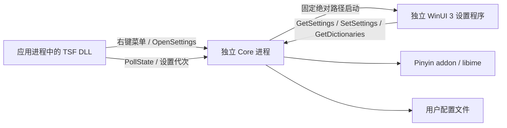

# Windows 输入法设置设计与实现

更新日期：2026-10-10。菜单、Core 方案切换、服务控制和独立 WinUI 窗口已实现，当前协议为 v5。设置窗口包含“拼音”和只读“词库”tab；词库目录、热重载和验证见 [pinyin.md](pinyin.md#third-party-dictionaries)。本文说明当前实现和仍需实测的范围。

## 当前方案

使用语言栏输入模式项提供右键菜单，包含“输入法设置”“用户数据文件夹”“重启服务”“关闭服务”。设置界面使用独立的 `Fcitx5Settings.exe`，采用 WinUI 3、C++/WinRT 和 XAML；通过用户/session 级 Named Pipe 与 Core 通信。当前目标是 Windows 11 和已验证的 AMD64 部署。

设置包含全拼/双拼和内置双拼键位。Core 是配置的唯一写入者和运行时状态的管理者，设置程序只保存尚未确认的界面草稿。用户点击确定，Core 确认保存并应用成功后关闭窗口。

## 实现位置

- `win32/tsf/langbaritem.cpp`：实现 `ITfLangBarItemButton`，左键切换模式；原生右键菜单与 `InitMenu` / `OnMenuSelect` 共用四项命令。
- `win32/tsf/pollstate.cpp`、`servicecontrol.cpp`：TSF 消息调度、100 ms 状态轮询和后台服务/目录操作。
- `win32/ipc/protocol.h`：v5 framing、设置消息、词库状态及运行时代次；全局请求与 context 请求分别校验。
- `src/main.cpp`：创建包含 `keyboard-us`、`pinyin` 和已安装的 `shuangpin` 的内存输入法组。
- `src/windowssettings.cpp`、`windowsfrontend.cpp`：权威配置保存、真实 profile 应用、中文 entry 切换与 context 同步。
- `src/windowsdictionaries.cpp`：扫描第三方词库目录，在 Core 主事件循环触发上游重载并查询实际加载状态。
- `win32/settings/SettingsWindow.cpp`：通过 `XamlReader` 创建两个 tab，后台执行设置和词库 IPC，支持保存/取消和连接重试。
- `chinese-addons/im/pinyin/`：复用上游 `setUseShuangpin()`、`ShuangpinProfile`、`setConfig()` 和已安装的 `shuangpin.conf`。

子模块版本保持固定；词库加载状态查询扩展记录在主仓库 `patches/chinese-addons-windows.patch`，不创建本地子模块提交。

## UI 框架依据

| 方案 | 与本项目的关系 | 结论 |
| --- | --- | --- |
| WinUI 3 / Windows App SDK | 微软原生 Fluent UI；XAML 支持缩放、主题、键盘导航；需要独立运行时和 XAML 构建工具 | 已采用 |
| 系统 UWP XAML / WinUI 2 / XAML Islands | 可以使用系统 XAML，但 WinUI 2 本身也是 NuGet 依赖；宿主集成增加窗口、线程和部署复杂度 | 不作为本次首选 |
| Win32 / Common Controls + DWM | 主要依赖系统组件，部署较轻；现代控件外观与 DPI 布局需要更多手动工作 | 仅在禁止附带 UI 运行时时作为备选 |
| WPF | 支持成熟的数据绑定和 DPI，但引入 .NET，Windows 11 风格需要额外选择与调整 | 本项目已有 C++，优先 WinUI 3 C++/WinRT |

WinUI 3 是 Windows App SDK 的 UI 部分，与操作系统和 Windows SDK 分开发布。只支持 Windows 11 也不能假定目标机器安装了匹配版本的 Windows App SDK runtime。

按用户选择采用 unpackaged + framework-dependent 文件夹部署。WinUI NuGet 固定为 `1.8.260803003`，运行时元数据固定为 `1.8.260921001`；需要当前用户安装 x64 Framework 和 DDLM 包 `8000.994.2142.0` 或更新兼容版本，以及 Visual C++ 运行库。应用启动时显式调用 bootstrap；缺少运行时显示错误，不自动安装。设置程序无需注册 MSIX。

独立 MSBuild `.vcxproj` 使用 MSVC、C++/WinRT 和 NuGet，由 `scripts/build-settings.ps1` 调用。界面通过 WinUI `XamlReader` 加载 XAML，复用系统控件和元数据提供者，不要求 UWP 工具工作负载。Core 的 MSYS2/Clang GNU 工具链和 TSF 的 Clang/Ninja 工程继续独立构建。

参考：

- [WinUI 3 的定位](https://learn.microsoft.com/en-ca/windows/apps/winui/winui3/)
- [Windows App SDK 部署概览](https://learn.microsoft.com/en-us/windows/apps/package-and-deploy/deploy-overview)
- [框架依赖应用的运行时初始化](https://learn.microsoft.com/en-us/windows/apps/windows-app-sdk/use-windows-app-sdk-run-time)
- [C++/WinRT 的 MSBuild 与 XAML 工具](https://learn.microsoft.com/en-us/windows/apps/develop/cpp-winrt/intro-to-using-cpp-with-winrt)

## 进程与生命周期

- TSF DLL 只增加轻量的菜单与打开设置请求。WinUI、XAML 初始化和窗口消息循环位于独立进程，设置程序关闭或崩溃不影响应用中的 TSF 生命周期。
- Core 根据自己的安装树定位 `settings/Fcitx5Settings.exe`，使用固定绝对路径启动，不搜索 PATH，不接受客户端传入可执行文件路径。
- 不修改 Core 的进程级 DLL 搜索环境。设置程序拥有自己的运行库部署目录，两端只传递协议数据，不跨进程传递引擎对象或分配器。
- 设置程序使用用户/session 级 named mutex 和 event 保证单实例；重复点击激活已有窗口，不依赖 AppLifecycle 的额外服务包。
- 打开设置不自动改变中英文开关。窗口是普通可激活的顶层窗口，不把用户正在编辑的应用作为模态 owner。
- TSF 激活时在工作线程后台启动安装树的 Core，Settings 按需启动。协议不匹配、设置程序缺失或启动失败时显示错误。DLL 应部署在安装树的 `tsf` 目录，固定定位相邻 `bin/Fcitx5.exe`。
- 重启服务正常停止并重启/启动 Core，原本打开的 Settings 在 Core 就绪后重新打开；关闭服务正常停止两者，并把当前登录会话的自动启动暂停状态保存到 `%LOCALAPPDATA%/fcitx5`。当前用户/session/logon LUID 级互斥防止重复启动，失败时共享 10 秒重试间隔。
- Core 在主事件循环处理退出信号，Settings 在 UI 线程关闭。TSF 所在进程本身是 Settings 时，以独立的 `Fcitx5 --restart-services/--stop-services` 短暂控制进程等待其退出，避免宿主退出等待自身。正常关闭超时返回错误，不强制杀进程。
- `OpenSettings` 回复只确认启动/激活请求结果，不等待 WinUI 初始化和用户操作。慢启动不得阻塞 Core 事件循环。

## 右键菜单

菜单使用原生 `HMENU` / `TrackPopupMenuEx`，由 TSF 所在线程显示，内容为“输入法设置”“用户数据文件夹”“重启服务”“关闭服务”。左键继续切换中英文模式，右键不触发模式切换。

“用户数据文件夹”在后台任务中通过 Windows Roaming AppData known folder 定位 `%APPDATA%/Fcitx5`，目录不存在时创建，再通过 Shell 打开。该目录同时包含 `config/fcitx5` 设置和 `pinyin` 用户词典、学习历史；服务关闭时仍可打开，不启动 Core 或 Settings，不涉及 IPC 协议变更。

`LangBarItem::OnClick(TF_LBI_CLK_RIGHT, ...)` 接入右键弹出路径；`InitMenu(ITfMenu*)` 与 `OnMenuSelect()` 也提供相同菜单项和统一命令处理。命令选中后先发送消息给 dispatch window，再由后台任务执行相应服务、`OpenSettings` 或目录操作，避免在菜单循环中执行 IPC。

当前 style 为 `TF_LBI_STYLE_BTN_MENU | TF_LBI_STYLE_BTN_TOGGLE | TF_LBI_STYLE_HIDDENSTATUSCONTROL | TF_LBI_STYLE_TEXTCOLORICON`。`test_langbar` 验证菜单内容、命令派发和停用后的迟到点击。Windows 11 实际输入指示器及浮动语言栏的右键回调和外观仍需实测；已有“中/A”指示器正常的用户反馈不能代替右键派发验证。

菜单显示期间保持对象/DLL 引用；owner 窗口需满足原生菜单的焦点和取消行为；退出菜单、停用、detach 后释放资源。迟到消息必须验证当前激活绑定，不能作用于新实例。不能缓存回调参数的裸指针。

参考：[OnClick](https://learn.microsoft.com/en-us/windows/win32/api/ctfutb/nf-ctfutb-itflangbaritembutton-onclick)、[InitMenu](https://learn.microsoft.com/en-us/windows/win32/api/ctfutb/nf-ctfutb-itflangbaritembutton-initmenu)、[语言栏 style](https://learn.microsoft.com/en-us/windows/win32/tsf/tf-lbi-style--constants)。

## 设置窗口

默认窗口为 560 × 480 个有效像素，最小跟踪尺寸为 440 × 360，创建/缩放时按窗口 DPI 转为 HWND 物理像素。拼音内容可纵向滚动，词库列表随布局伸缩。

| 内容 | 控件与行为 |
| --- | --- |
| 标题 | “输入法设置”，使用系统标题栏 |
| 页面 | `TabView`：“拼音”“词库”；不可关闭、添加或重排 tab |
| 输入方案 | `RadioButtons`：全拼、双拼 |
| 双拼键位 | `ComboBox`：小鹤、自然码、微软、紫光、智能 ABC、中文之星、拼音加加、国标 |
| 全拼时的键位 | 保留选项但禁用，重新选择双拼时恢复 |
| 底部操作 | “取消”“确定”；取消/关闭不写配置 |
| 状态 | 加载中、正在保存、连接失败、保存失败、配置冲突 |
| 连接重试 | 连接失败后显示“重试”，重新读取 Core 设置 |
| 词库页 | 展示目录及加载中/已加载/失败/停用状态，显示期间每两秒查询 Core |
| 词库目录按钮 | 创建并打开第三方词库目录，Core 无法连接时仍可使用；无导入/删除/启停控件 |

窗口打开后读取 Core 的实际设置；不使用 UI 本地默认值覆盖已有配置。第一次没有 Windows 设置文件时，默认全拼，键位从当前 Pinyin 配置继承。自定义双拼暂不提供编辑或导入；如果检测到已有 Custom 配置，应保留并明确显示现有自定义方案，不能静默覆盖为内置键位。

确定按钮在加载/保存期间禁用。保存失败保留用户选择并显示错误；成功后关闭。配置冲突时更新草稿的 revision，用户再次确定才提交当前选择。使用原生键盘导航、Automation 属性、系统主题资源和 `MicaBackdrop`；深浅色、高对比度、文本缩放及背景回退仍需全面实测。

HiDPI 使用 XAML 有效像素和独立进程的 Per-Monitor DPI awareness；窗口初始大小/位置涉及 HWND 物理坐标时显式换算。验证不同 DPI 显示器之间拖动、任务栏位置、屏幕工作区和放大文本，不在 TSF DLL 内修改宿主进程的 DPI awareness。

参考：[XAML 有效像素与缩放](https://learn.microsoft.com/en-us/windows/apps/design/layout/screen-sizes-and-breakpoints-for-responsive-design)、[Mica](https://learn.microsoft.com/en-us/windows/apps/design/style/mica)。

## IPC 与配置所有权

设置功能最初升级协议至 v4；当前 v5 另增加 `GetDictionaries`。同步构建 Core、TSF DLL 和设置程序。以下 context-independent 消息强制 `contextId=0`，单独验证请求长度、枚举和请求关联。旧的 context 请求仍保留连接归属校验。

| 请求 | 内容 / 回复 |
| --- | --- |
| `OpenSettings` | 无可执行路径参数；返回启动/激活结果 |
| `GetSettings` | 返回 `PinyinSettings`（scheme、profile、revision）及 `pinyinAvailable` / `shuangpinAvailable` |
| `SetSettings` | 提交 scheme、profile、revision（草稿读取时的版本）；返回实际配置、新 revision 或错误 |
| `GetDictionaries` | 返回第三方词库目录、实际发现的扩展词库路径和加载状态 |

scheme 使用明确枚举；profile 使用稳定的协议 ID 或上游字符串标识，不依赖 ComboBox 索引。映射到 `Xiaohe`、`Ziranma`、`MS`、`Ziguang`、`ABC`、`Zhongwenzhixing`、`PinyinJiajia`、`GB`，服务器严格校验。

协议 ID、引擎枚举和 `RawConfig` 字符串分别映射。尤其国标的引擎枚举是 `GB`，但 `ShuangpinProfile` 的实际序列化值是 `GB Standard`；不能直接写入枚举标识符或中文 UI 标签。配置更新后必须读取结果验证，防止无效字符串被配置加载器拒绝却仍回复成功。

设置程序独立建立 Pipe 连接，直接编译 `win32/tsf/pipeclient.cpp`，复用 `win32/ipc/protocol.h` 和 `transport.h`，不链接整个 `tsf` 静态库。I/O 通过 C++/WinRT `resume_background()` 放到后台线程，返回 UI apartment 后更新控件。

错误返回区分引擎缺失、非法设置、版本冲突、持久化失败和应用失败。保存超时可能已经在服务端生效，因此重连后先 `GetSettings` 核对结果，不盲目重放写请求。重复提交同一已生效配置幂等成功；请求的 `revision` 防止独立客户端的旧草稿覆盖新配置。

全局设置允许当前用户的独立连接访问，沿用 SID/session 命名、当前用户 ACL 和拒绝远程访问。仅暴露这两项设置，不开放任意 addon 配置或文件路径操作。

## 真正切换引擎

1. 启动时确认 `shuangpin` entry、Pinyin addon 和数据均存在，将 `shuangpin` 加入内存 Windows 输入法组。
2. Core 保存全局的中文方案，选中的中文 entry 为 `pinyin` 或 `shuangpin`；中英文 enabled 仍是每个 TSF 实例通过 compartment 设置的状态。
3. 通过 addon 的公开配置接口读取完整 `RawConfig`，只修改 `ShuangpinProfile`，保留词库、模糊音和其他设置；调用 `setConfig()` 更新真实 libime profile。
4. 在 Core 主事件循环内执行设置操作。Pipe worker 不直接操作 Instance、addon 或 context。
5. 中文 context 切换到选定 entry；英文 context 保持 `keyboard-us`，下一次打开中文时使用新方案。新的焦点和重连也使用新方案。
6. scheme 或双拼键位改变时，取消旧方案尚未提交的预编辑和候选，不自动选词提交；已经提交的文本保持有效。相同设置不重复 reset。
7. 全部 `SetMode`、`FocusIn`、按键回复、PollState 和 Reset 的 enabled 判断都使用“当前 entry 是否为支持的中文 entry”，不能继续只判断 `pinyin`。

设置全局生效，不要求重启 Core、重新注册 DLL 或重启应用。只增加设置入口的正常功能更新不应被设计成必须重新注册的操作；若同时修改注册元数据，仍按项目现有规则单独处理。

## 持久化与状态一致性

主仓库的 `WindowsSettings` 通过 Fcitx `StandardPaths` 保存用户级 `conf/windows.conf`，将 scheme、profile 和 revision 放在一个版本化记录内。默认实际路径为 `%APPDATA%/Fcitx5/config/fcitx5/conf/windows.conf`；此文件是这两项设置的权威来源，设置程序不直接写文件。

Pinyin 的 `setConfig()` 还会保存 `conf/pinyin.conf`，但现有实现不向调用方返回保存失败。这份文件只作为上游配置的兼容镜像；不能把一次 `setConfig()` 返回视为完整持久化成功。Core 每次启动读取 Windows 权威记录，并重新应用其中的 profile，使中断造成的镜像差异不会改变已确认的 Windows 设置。

保存流程先校验能力和 revision，保留旧配置快照，安全写入 Windows 权威记录，再更新引擎配置并核对读取结果，最后发布新设置代次并切换 contexts。此顺序来自实际代码约束：libime 的 profile 更新会发出 `optionChanged` 并清空解码上下文，回滚配置不能恢复已经清空的预编辑。存储失败必须在调用 addon 前返回。引擎应用失败恢复旧配置和旧权威记录，同时 reset contexts 并更新独立的运行时代次；此异常路径会取消预编辑。启动时以最后一个完整权威记录为准，不能合并两个文件中的半次更新。保存过程中进程被终止时，重启可能应用已写入但尚未回复的设置；UI 超时后查询实际结果。

配置目录仍由 `StandardPaths` 决定；Windows 权威记录由主仓库 `atomicfile.h` 使用同目录临时文件、`FlushFileBuffers` 和 `MoveFileExW(REPLACE_EXISTING | WRITE_THROUGH)` 替换。`test_settingsfile` 验证重复覆盖、只读失败和临时文件清理；`settings_probe --read-only-file PATH` 验证失败不清空实际解码预编辑。断电/文件系统故障恢复尚未验证。

`KeyReply::settingsRevision` 是独立的运行时代次，不复用每次 snapshot 都递增的文本 revision，也不同于 `PinyinSettings::revision`。应用失败后需要 reset 时运行时代次也会增长，因此不要求它永远等于持久化配置 revision。TSF 在处理回复时识别代次，旧异步会话保留 commit、清空 preedit/candidates。TSF 在 edit pending 时仍轮询，及时观察新设置；焦点切换时仍遵循既有 context/generation 隔离。

## 文件与构建范围

| 范围 | 当前文件与职责 |
| --- | --- |
| TSF 菜单与同步 | `win32/tsf/langbaritem.*`、`pollstate.cpp`、`pipeclient.*`、编辑会话相关状态 |
| 协议 | `win32/ipc/protocol.h`：设置序列化、结构化错误和词库查询 |
| Core | `src/main.cpp`、`windowsfrontend.*`、`windowssettings.*`、`windowsdictionaries.*` |
| 设置程序 | `win32/settings/`：独立 `.vcxproj`、运行时 XAML、窗口和客户端 |
| 部署 | `scripts/build-settings.ps1`、`deploy-tsf.ps1`、`build-and-deploy.ps1`：构建并联合部署至运行树；系统运行时需另行准备 |
| 验证 | `win32/tests/`、拼音/词库/服务/UI 脚本；CI 包含独立 Settings 构建和词库集成验证 |

Core 和 TSF 使用两套独立 CMake 工程；MSBuild 设置程序由统一脚本调度，不把 WinUI 工具要求强加给只构建 Core 的用户。统一入口暂存目录默认是 `build/all/prefix`，Settings 的 MSBuild 输出/缓存仍在 `win32/build/settings`，不受 `-BuildRoot` 影响。完整构建选项见 [build.md](build.md)。

## 验证与剩余范围

关键自动验证：

- `test_langbar`：菜单项文字和 ID、空指针、未知命令、左键行为、detach 后命令、菜单与 DLL 引用生命周期。
- `test_protocol`：设置/词库消息往返、非法枚举、截断/额外字段、冲突错误编码和全局请求分类；真实 context 连接归属校验由 `ipc_probe` 覆盖，设置 revision 冲突由 `settings_probe` 覆盖。
- `ipc_probe`：基础全拼按键、候选、提交、模式和连接归属；`settings_probe` 验证全拼 `nihao`、小鹤 `nihc`、自然码 `nihk` 的真实“你好”候选/提交及方案切换。其他内置 profile 仍需选择键位差异明确的音节验证，不能只检查配置字段。
- `tsf_probe`：实际 DLL 的双拼文本插入、英文放行、SetMode 幂等、多个 context、设置变更时的迟到编辑与取消。
- 持久化：`test_settingsfile` 覆盖重复覆盖、只读失败和临时文件清理；`settings_probe --read-only-file PATH` 覆盖真实存储失败时保留预编辑，UI 自动化覆盖重启恢复。镜像不一致恢复、保存超时及设置程序崩溃的故障注入仍需补充验证。

实际 Windows 11 验证：任务栏指示器右键出现单条“输入法设置”，左键仍切换；重复点击只显示一个窗口；记事本、浏览器和至少一个复杂文本应用中方案立即生效；100%/150%/200% DPI 和跨屏拖动、深浅色、高对比度、文本缩放、Explorer 重启及 Core 断连。

probes 的适配器回调不能代替实际 OS 菜单派发和真实应用验证。第一阶段不宣称 Windows 10、ARM64 TSF、双拼自定义方案和全部 Windows 输入兼容性已经受支持。

## 已记录的验证

- 设置功能的 AMD64 Core、TSF Release、WinUI Release 构建和当时的 8 项默认 CTest 已通过。加入 `test_candidate` 后当前默认为 9 项；后续候选窗改动的 9 项测试和真实拼音/TSF probes 均已通过，详见 [候选窗验证记录](windows-candidate-rendering.md#verification)。这些是既有验证记录，本次文档更新不代表重新执行了构建或集成测试。
- `ipc_probe`、`settings_probe` 和扩展后的 `tsf_probe` 通过，真实全拼/小鹤/自然码中文提交、英文保持、存储失败保留解码上下文和迟到编辑取消均验证。
- 按用户明确授权安装当前用户的 x64 DDLM `8000.994.2142.0` 后，`scripts/test-settings-ui.ps1` 验证实际窗口、确定/取消、自然码/小鹤、重启恢复和单实例，截图在 `build/settings-ui-test`。窗口当前 200% 缩放正常；跨屏、文本缩放、高对比度和其他主题仍未全面验证。
- 未执行输入法注册/注销，真实任务栏指示器右键菜单派发尚未实测。
- 服务控制新增验证：`win32/build/service-tsf`、`dist/pinyin/tsf` 的实际 DLL 自动启动 Core、模拟菜单停止/重启、重新激活时保持暂停、按需启动 WinUI、重开原设置窗口、Settings 宿主委托退出和迟到 Settings 启动拒绝均通过。原有三个拼音 probes 和实际 WinUI 保存/取消、重启恢复、单实例重新通过，截图位于 `build/service-settings-ui-test`。
- 第三方词库验证包含真实启动加载、热增删改、Unicode 路径、坏文件、停用标记、全拼/小鹤/自然码候选和预编辑保留；WinUI 自动化覆盖实际加载/失败状态及 Explorer 目录打开。200% 缩放的正常/最小窗口截图位于 `build/dictionaries-settings-ui-test`，使用 `dist/dictionaries-test` 隔离部署。
